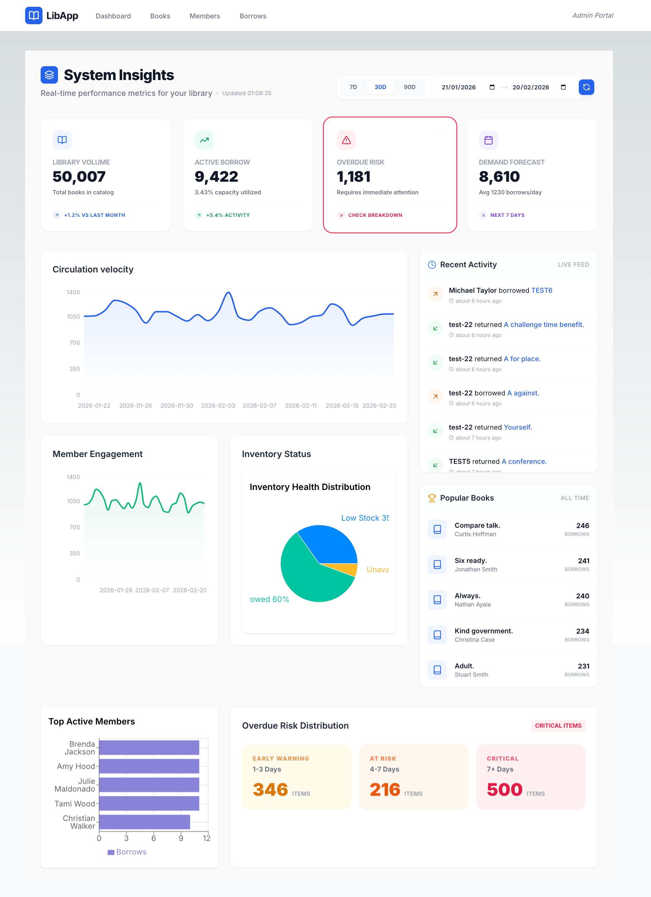
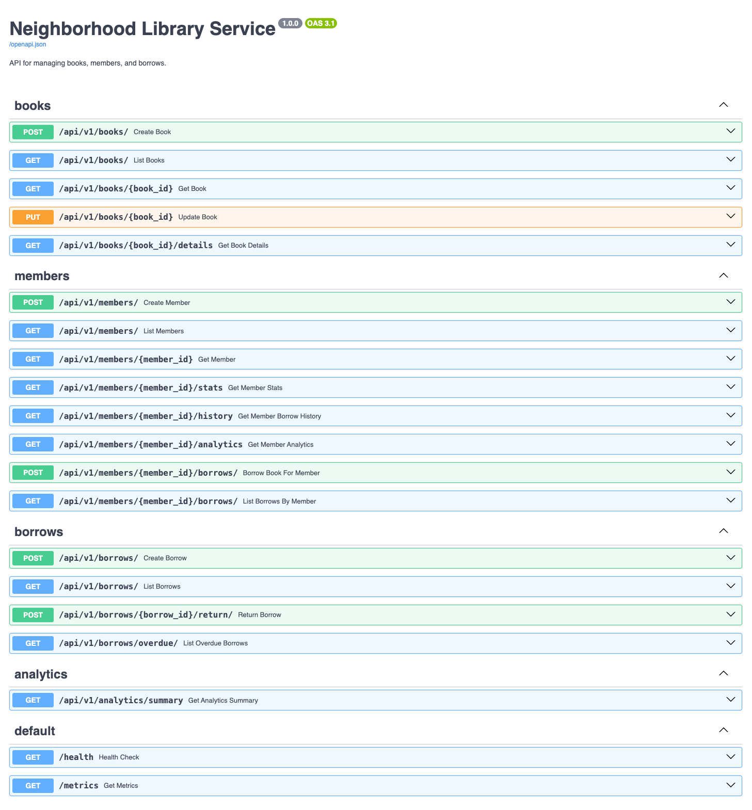
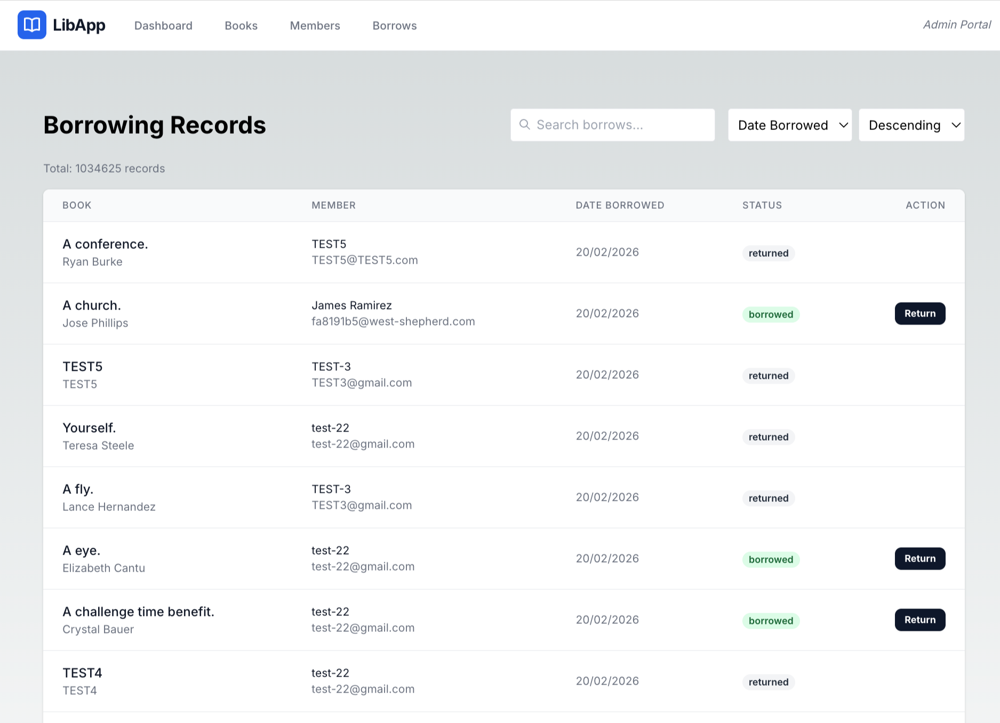
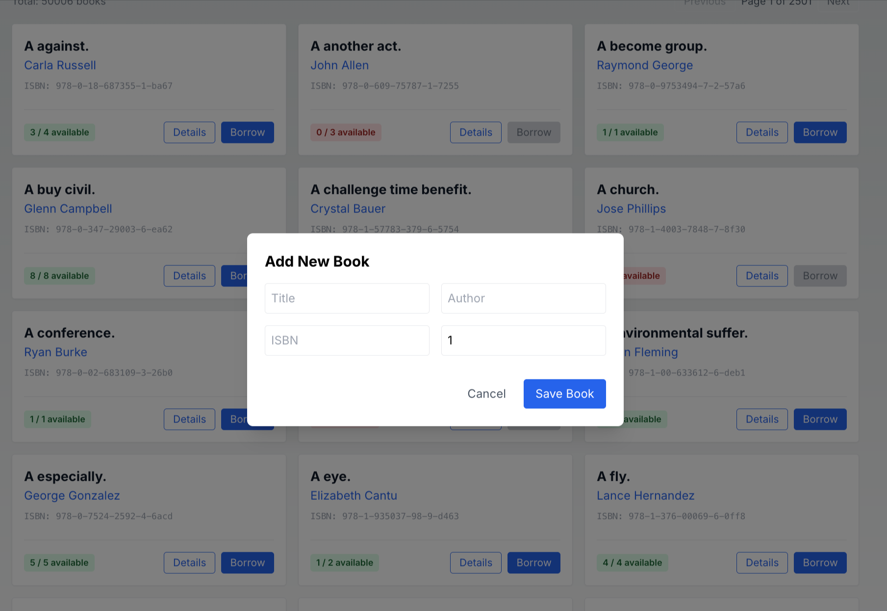
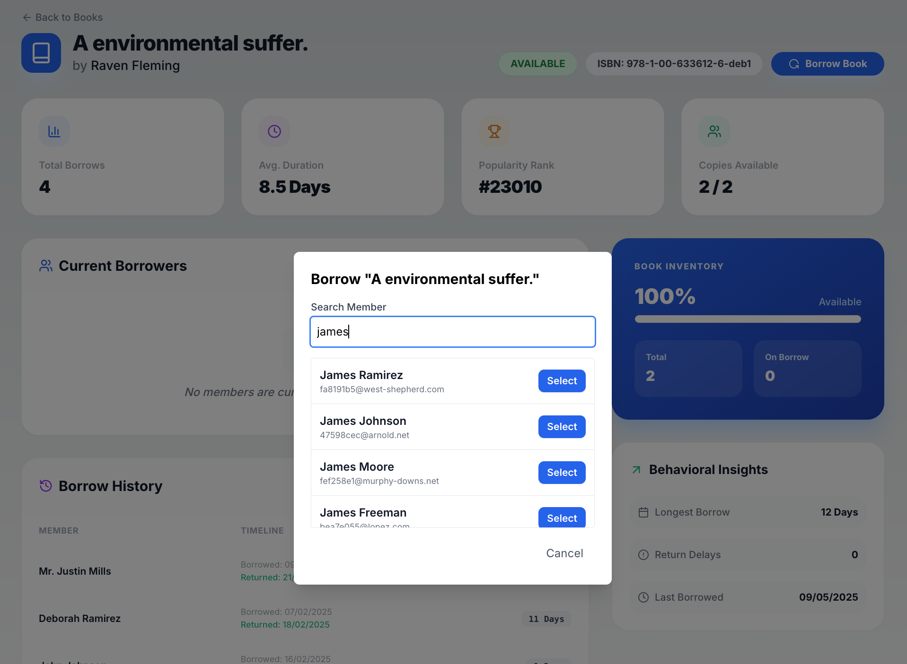
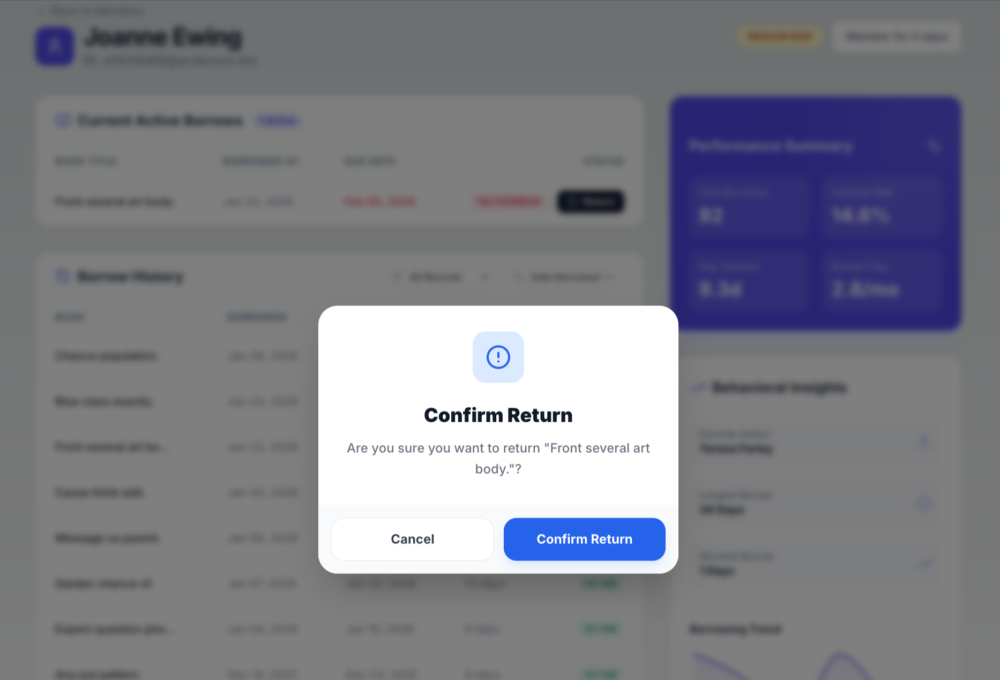
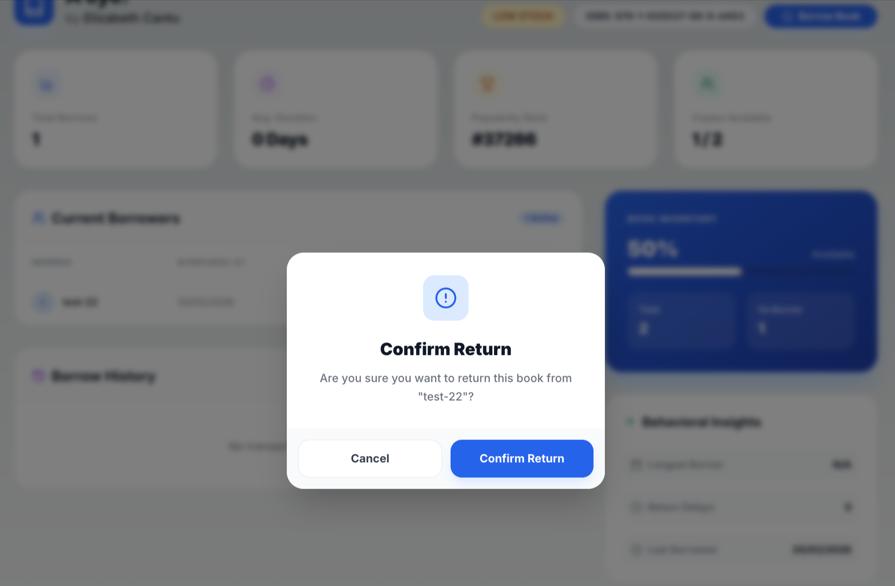

# Neighborhood Library Service


## 🎬 Demo


<p align="center">
  
  
</p>
<p align="center">
  
  
  
  
</p>
<p align="center">
  
  
  
</p>
<p align="center">
  
  
  
</p>

---

## Validated At Scale

| Metric | Value |
|:-------|:------|
| Books | 200,000 |
| Members | 60,000 |
| Borrow Records | ~4,000,000 |
| Simulation Span | 10 years (120 months) |
| Seeder Throughput | **~26,000 records/sec** |
| Search Latency | **< 500ms** (GIN trigram index, 200k books) |
| Pagination | **O(1)** at any page depth (keyset cursor) |
| Dashboard Analytics | **< 2s** (single-query consolidation) |

---

## Tech Stack

### Backend
| Library | Role |
|:--------|:-----|
| **FastAPI** (Python 3.9+) | ASGI web framework |
| **SQLAlchemy 2.0** | ORM with `with_for_update()` support |
| **Alembic** | Schema migrations |
| **Pydantic v2** | Request/response validation & serialization |
| **Pytest + pytest-cov** | Test suite with coverage |
| **psycopg2** | PostgreSQL driver |

### Frontend
| Library | Role |
|:--------|:-----|
| **Next.js 13.5** (App Router) | React framework |
| **TypeScript** | Static typing across all components |
| **Tailwind CSS** | Utility-first styling |
| **TanStack Query** | Server state, caching, pagination |
| **Recharts** | Borrow trend & analytics charts |
| **Lucide React** | Icon system |

### Infrastructure
| Tool | Role |
|:-----|:-----|
| **PostgreSQL 15** | Primary database with GIN indexes + partial indexes |
| **Docker + Docker Compose** | Containerized services with health checks |
| **GNU Make** | Developer workflow automation |

---

## Prerequisites

Before you begin, install:

| Requirement | Min Version | Purpose |
|:------------|:------------|:--------|
| Docker + Docker Compose | 24+ | Database & containerized stack |
| Python | 3.9+ | Backend runtime |
| Node.js | 18+ | Frontend runtime |
| GNU Make | any | Project automation |

---

## Project Structure

```
libapp/
├── backend/
│   ├── app/
│   │   ├── api/
│   │   │   ├── v1.py              # Versioned router aggregation
│   │   │   └── exception_handlers.py
│   │   ├── core/
│   │   │   ├── config.py          # Pydantic settings (env vars)
│   │   │   ├── decorators.py      # @db_retry, @measure_borrow_metrics
│   │   │   ├── exceptions.py      # Domain-specific exception hierarchy
│   │   │   ├── logging.py         # Structured JSON logger + correlation ID ctx
│   │   │   ├── metrics.py         # In-memory borrow metrics
│   │   │   └── security.py        # Sliding-window rate limiter
│   │   ├── db/
│   │   │   └── session.py         # SQLAlchemy engine + SessionLocal
│   │   ├── domains/               # Domain-driven vertical slices
│   │   │   ├── books/             # router, service, repository, schemas
│   │   │   ├── members/
│   │   │   ├── borrows/
│   │   │   └── analytics/
│   │   ├── models/
│   │   │   ├── book.py            # Book model (check constraint: available >= 0)
│   │   │   ├── member.py
│   │   │   └── borrow_record.py   # Partial index on active borrows
│   │   ├── seeds/
│   │   │   ├── high_scale_seeder.py  # Parallel multi-threaded seeder
│   │   │   ├── scenarios.py         # Seed config: minimal → high_scale
│   │   │   └── seed_runner.py       # CLI entry point
│   │   └── shared/
│   │       ├── schemas.py         # PaginatedResponse, PaginationMeta
│   │       └── deps.py            # FastAPI dependencies (get_db)
│   ├── migrations/                # Alembic migration history
│   ├── tests/                     # Pytest suite
│   └── requirements.txt
├── frontend/
│   ├── app/                       # Next.js App Router pages
│   ├── components/                # Shared UI components
│   ├── hooks/                     # Custom React hooks
│   ├── lib/                       # API client + utilities
│   └── types/                     # TypeScript interfaces
├── docker-compose.yml
└── Makefile
```

---

## Docker Workflow — Full Containerized Stack

To run the **entire stack** (DB + API + Frontend) in Docker:

```bash
# Build and start all services
make docker-up

# Check status
make docker-ps

# View logs for a specific service
docker-compose logs -f api
docker-compose logs -f db
docker-compose logs -f frontend

# Trigger a clean re-seed via the seeder container
make docker-seed

# Tear down everything (removes volumes and data)
make docker-down
```

## Quick Start — Local Development

**Follow these steps in order.** A developer should be up and running in under 5 minutes.

### 1. Clone the repository

```bash
git clone <repo-url>
cd libapp
```

### 2. Configure environment

Create a `.env` file in the **project root** (copy from below):

```bash
cat > .env << 'EOF'
POSTGRES_USER=user
POSTGRES_PASSWORD=password
POSTGRES_DB=library
POSTGRES_SERVER=localhost
POSTGRES_PORT=5432
ENVIRONMENT=development
EOF
```

Also create one for the backend:

```bash
cp .env backend/.env
```

### 3. Start the database

```bash
make docker-db
```

This starts a PostgreSQL 15 container in the background on port `5432`.

> **Using a local PostgreSQL?** If you have Postgres running locally on a different port (e.g., 9011), update `POSTGRES_PORT` in `backend/.env`.

### 4. Install dependencies

```bash
make install
```

This installs `backend/requirements.txt` via pip and `frontend/package.json` via npm.

### 5. Initialize the database schema

```bash
make db-migrate
```

Runs all Alembic migrations to create tables, indexes, and extensions (`pg_trgm`).

### 6. Seed with sample data

```bash
make db-seed         # ~5,000 books, 1,000 members (fast, good for dev)
```

For a heavier dataset:

```bash
make db-seed-high    # 200k books, 60k members, 4M borrows (~3.5 min)
```

### 7. Start development servers

```bash
make start
```

This starts:
- Backend (FastAPI + Uvicorn) on **http://localhost:8000**
- Frontend (Next.js) on **http://localhost:3003**

### 8. Verify it's working

| URL | What you'll see |
|:----|:----------------|
| http://localhost:3003 | Library dashboard |
| http://localhost:8000/docs | Swagger UI (interactive API docs) |
| http://localhost:8000/health | `{"status": "ok", "db": "connected"}` |
| http://localhost:8000/metrics | In-memory borrow metrics |

---


> Inside Docker, the API connects to the DB via the service name `db`. The `POSTGRES_SERVER=db` env var is set automatically in `docker-compose.yml`.

---

## All Make Commands

### Setup & Lifecycle

| Command | Description |
|:--------|:------------|
| `make setup` | DB + install + migrate + seed (minimal). One-shot fresh start. |
| `make setup-high` | DB + install + migrate + high-scale seed (4M records). |
| `make install` | Install backend pip deps + frontend npm deps |
| `make start` | Start backend (:8000) and frontend (:3003) concurrently |
| `make dev` | Alias for `start` |
| `make build` | Build Next.js production bundle |

### Database

| Command | Description |
|:--------|:------------|
| `make db-migrate` | Apply all pending Alembic migrations (`alembic upgrade head`) |
| `make db-migration m='add_index'` | Auto-generate a new migration from model diff |
| `make db-seed` | Seed with `minimal` scenario (~5k books, 1k members) |
| `make db-seed-high` | Seed with `high_scale` (200k books, 60k members, 4M borrows) |
| `make db-reset` | Truncate all tables (destructive) |
| `make db-fresh` | Truncate → re-migrate → re-seed (clean slate) |
| `make db-shell` | Open interactive `psql` shell in the DB container |

### Docker

| Command | Description |
|:--------|:------------|
| `make docker-db` | Start only the PostgreSQL container |
| `make docker-up` | Build all images and start all services (detached) |
| `make docker-down` | Stop all containers and remove volumes |
| `make docker-seed` | Run the seeder container (tools profile) |
| `make docker-ps` | List running containers and their ports |

### Code Quality

| Command | Description |
|:--------|:------------|
| `make test` | Run Pytest with coverage (`--cov=app`) |
| `make lint` | Ruff + Mypy (backend) + ESLint (frontend) |
| `make format` | Auto-format backend code with Ruff |
| `make clean` | Remove `__pycache__`, `.pytest_cache`, `.next`, build artifacts |

---

## Environment Variables

All config is loaded from `.env` files via Pydantic's `BaseSettings`.

### backend/.env

| Variable | Default | Description |
|:---------|:--------|:------------|
| `POSTGRES_USER` | `user` | DB username |
| `POSTGRES_PASSWORD` | `password` | DB password |
| `POSTGRES_DB` | `library` | DB name |
| `POSTGRES_SERVER` | `localhost` | DB host (`db` inside Docker) |
| `POSTGRES_PORT` | `5432` | DB port |
| `ENVIRONMENT` | `development` | Runtime env (`production` blocks seeding) |
| `MAX_ACTIVE_BORROWS` | `5` | Max concurrent borrows per member |
| `DEFAULT_BORROW_DURATION_DAYS` | `14` | Default due date window |

### docker-compose / seeder

| Variable | Default | Description |
|:---------|:--------|:------------|
| `SEED_DATA` | `false` | Set to `true` to auto-seed on container start |
| `SEED_SCENARIO` | `minimal` | Seeding scenario to use |
| `FORCE_SEED` | `false` | Force re-seed even if data exists |

---

## Architecture

The codebase is organized into **domain-driven vertical slices**. Each domain owns its full stack — router, service, repository, and schemas — with no cross-domain leakage.

```
domains/
├── books/          ← books only: listing, search, inventory, analytics
├── members/        ← members only: profiles, history, risk scoring
├── borrows/        ← borrow lifecycle: lock → create → return → release
└── analytics/      ← aggregations only: never writes, never owns data
```

Within each domain, a strict **four-layer boundary** is enforced:

```
HTTP → Router → Service → Repository → PostgreSQL

Router:
  Validate & serialize. No business logic.

Service:
  Enforce invariants. Define transactions. Manage locks.

Repository:
  Execute queries. Handle pagination & aggregations.

PostgreSQL:
  Enforce constraints. Maintain integrity. Optimize execution.
```

**Services never raise `HTTPException`.** They raise typed domain exceptions (`InventoryUnavailableError`, `BorrowLimitExceededError`, etc.) that are mapped to HTTP responses by a centralized exception handler in `api/exception_handlers.py`. This keeps the service layer fully testable without an HTTP context.

**Repositories never contain business rules.** A repository can tell you how many books are available. It cannot decide whether that number is enough to allow a borrow — that decision lives in the service.

This boundary is the reason the system stays maintainable as it grows. Adding a new feature means touching exactly one domain. Adding a new query means touching exactly one repository. Nothing bleeds.


---

## API Design

All list endpoints share a consistent contract:

```
GET /api/v1/books?limit=20&cursor=<token>&sort_by=title&order=asc&q=python
```

**Paginated Response:**
```json
{
  "data": [...],
  "meta": {
    "total": 200000,
    "limit": 20,
    "has_more": true,
    "next_cursor": "python guide:a1b2c3d4-..."
  }
}
```

### Core Endpoints

```
# Books
GET    /api/v1/books/                  List books (search, sort, paginate)
POST   /api/v1/books/                  Create a book
GET    /api/v1/books/{id}              Book detail
PUT    /api/v1/books/{id}              Update a book
DELETE /api/v1/books/{id}              Delete a book
GET    /api/v1/books/{id}/borrows      Borrow history for this book
GET    /api/v1/books/{id}/analytics    Popularity, utilization, duration stats

# Members
GET    /api/v1/members/                List members
POST   /api/v1/members/                Create a member
GET    /api/v1/members/{id}            Member detail
PUT    /api/v1/members/{id}            Update a member
DELETE /api/v1/members/{id}            Delete a member
GET    /api/v1/members/{id}/borrows    Borrow history for this member
GET    /api/v1/members/{id}/analytics  Reading stats, risk score, trend

# Borrows
GET    /api/v1/borrows/                List all borrows (filter: status, overdue)
POST   /api/v1/borrows/                Borrow a book (triggers inventory lock)
POST   /api/v1/borrows/{id}/return     Return a book (atomic inventory restore)
GET    /api/v1/borrows/overdue         List all currently overdue borrows

# Analytics (Dashboard)
GET    /api/v1/analytics/stats/summary      Library overview (books, borrows, overdue, utilization)
GET    /api/v1/analytics/stats/trends       Daily active members + borrow counts
GET    /api/v1/analytics/stats/top-members  Leaderboard by borrow count
GET    /api/v1/analytics/stats/popular      Top books by borrow count
GET    /api/v1/analytics/stats/activity     Recent activity feed
GET    /api/v1/analytics/inventory/health   Low stock, never borrowed, unavailable

# Infrastructure
GET    /health                         DB connectivity check
GET    /metrics                        In-memory borrow success/failure counters
```

---

## Key Engineering Decisions

### 1. Keyset (Cursor) Pagination — O(1) at Any Depth

Standard offset pagination (`LIMIT 20 OFFSET 100000`) is **O(N)** because PostgreSQL scans and discards the first 100,000 rows. At 4M records, this becomes unusable.

Instead, every list endpoint uses a cursor encoding the last-seen sort value + UUID:

```python
# Example: cursor = "The Python Cookbook:a1b2c3d4-..."
if sort_order == "asc":
    stmt = stmt.where(
        (sort_column > cursor_val) |
        ((sort_column == cursor_val) & (Book.id > UUID(cursor_id)))
    )
```

The result: page 200 loads in the **same time** as page 1.

---

### 2. Concurrency-Safe Inventory — SELECT FOR UPDATE

Borrowing a book uses a **row-level pessimistic lock** to prevent race conditions:

```python
# BookRepository.get_with_lock()
stmt = select(Book).where(Book.id == id).with_for_update()
```

Business rule enforcement in the service layer:
1. Count active borrows — reject if `≥ MAX_ACTIVE_BORROWS (5)`
2. Check for duplicate active borrow on the same book
3. Lock the book row
4. Check `available_copies > 0` — reject if exhausted
5. Decrement `available_copies`, create `BorrowRecord`, commit atomically

Even under concurrent requests, inventory never goes negative. This is enforced both in application code **and** at the database level via a check constraint.

---

### 3. Automatic Retry with Exponential Backoff

The `@db_retry` decorator on `borrow_book` and `return_book` handles transient database errors:

```python
@db_retry(max_retries=3, base_delay=0.1, max_delay=1.0)
def borrow_book(self, book_id, member_id):
    ...
```

On deadlock or stale data errors:
- Rollback the session
- Wait with **exponential backoff + jitter**: `delay = base * 2^retry + rand(0, 0.1*delay)`
- Retry up to 3 times before surfacing the error

---

### 4. Consolidated Analytics Queries

Naïve implementations make one query per metric. This system uses **single-query conditional aggregation**:

```python
# One round-trip for all borrow stats
borrow_stats = session.execute(
    select(
        func.count(BorrowRecord.id).filter(status == BORROWED).label("active"),
        func.count(BorrowRecord.id).filter(
            and_(status == BORROWED, due_date < now)
        ).label("overdue")
    )
).first()
```

The inventory health query consolidates `low_stock`, `unavailable`, and `never_borrowed` into a **single SQL statement** using `EXISTS` subqueries inside filter expressions.

---

### 5. Sliding-Window Rate Limiter

An in-memory **O(1)** sliding window rate limiter protects write and search endpoints:

```python
class SlidingWindowRateLimiter:
    # 100 requests/minute per IP
    # Implementation: deque of timestamps, evict entries older than 60s
```

Returns `HTTP 429` with `detail: "Rate limit exceeded"` when triggered. Applied as a FastAPI dependency on borrow, return, and search routes.

---

### 6. Full-Request Observability

Every request gets a **Correlation ID** (from header or auto-generated):

```
X-Correlation-ID: 3f2e1a9b-...
```

- Propagated to **all log lines** in that request via Python `contextvars.ContextVar`
- Echoed back in every **response header**
- Logs are structured JSON with UTC timestamps — ready for any log aggregation platform

---

### 7. GIN Trigram Full-Text Search

Book search (`title`, `author`, `isbn`) uses PostgreSQL's `pg_trgm` extension with GIN indexes:

```sql
CREATE INDEX ix_book_title_gin ON book USING GIN (title gin_trgm_ops);
```

This enables **sub-500ms search** across 200,000 books using ilike patterns.

---

## Realistic Data Seeding

The seeder models **real-world behavioral patterns**, not just random data.

### Seeding Scenarios

| Scenario | Books | Members | Borrows | Use Case |
|:---------|:------|:--------|:--------|:---------|
| `minimal` | 5,000 | 1,000 | ~2,250 | Default local dev |
| `load_test` | 10,000 | 2,000 | ~7,500 | Performance testing |
| `scaled_demo` | 50,000 | 5,000 | ~25,000 | Demo presentation |
| `high_scale` | 200,000 | 60,000 | ~4,000,000 | Scale validation |

### Behavioral Modeling

**Book Tiers** — controls selection probability:
- **Tier A** (5% of books): 50x selection weight — bestsellers
- **Tier B** (25%): 10x weight — popular
- **Tier C** (50%): 1x weight — long tail
- **Tier D** (20%): never selected — dead inventory

**Member Segments** — controls borrow frequency:
- **Heavy** (5%): power users
- **Regular** (50%): steady borrowers
- **Casual** (25%): occasional
- **Inactive** (20%): never borrow

**Time patterns simulated**:
- Seasonal variation: Nov/Dec +30% spike, Jun/Jul -20% dip
- 12% overdue probability per borrow
- Gaussian distribution of daily borrow volume

### Parallel Seeder Architecture

At 4M records, sequential insertion would take hours. The seeder uses `ThreadPoolExecutor` with independent database sessions per thread:

```
Time range (10 years)
        ↓
Split into N chunks (one per CPU core)
        ↓
ThreadPoolExecutor(max_workers=8)
  ├── Worker 1 → SessionLocal → 500k records → commit
  ├── Worker 2 → SessionLocal → 500k records → commit
  └── ...
        ↓
Inventory sync: single atomic SQL UPDATE with GREATEST(0, ...)
```

**Result: ~26,000 records/sec. Full high_scale seed in ~3.5 minutes.**

---

## Testing Strategy

```bash
make test    # Run all tests with coverage report
make lint    # Ruff + Mypy + ESLint
```

**Test coverage includes:**

| Category | What's tested |
|:---------|:-------------|
| Borrow rules | Max borrow limit, duplicate active borrow prevention |
| Concurrency | Inventory integrity under concurrent borrow requests |
| Inventory | `available_copies` never goes below 0 |
| Return flow | Status transitions, timestamp assignment |
| Pagination | Cursor decoding, edge cases (empty results, last page) |
| Analytics | Aggregation correctness for overdue, utilization, trends |
| Not-found | All 404 paths raise typed domain exceptions |

---

## High-Scale Performance Validation

To validate the system at full design capacity from scratch:

```bash
# Step 1: Tear down any existing containers + data
make docker-down

# Step 2: Start the database
make docker-db

# Step 3: Install deps, apply migrations, and seed at maximum scale
make setup-high   # ~5-10 min for 200k books + 4M borrows

# Step 4: Start the application
make start
```

**What to validate:**

| Feature | Expected |
|:--------|:---------|
| Dashboard load | < 2 seconds (consolidated single-query analytics) |
| Book search | < 500ms (GIN trigram index, 200k books) |
| Deep pagination | Same speed as page 1 (keyset cursor) |
| Concurrent borrows | No negative inventory (row-level locking) |
| Rate limit | Returns `429` after 100 req/min per IP |

---

## Troubleshooting

### Port conflicts

```bash
# Kill whatever's on port 8000
lsof -ti:8000 | xargs kill -9

# Kill whatever's on port 3003
lsof -ti:3003 | xargs kill -9
```

### Database won't connect

```bash
make docker-ps              # Is the db container running?
docker-compose logs db      # Any startup errors?
make db-fresh               # Nuclear option: truncate + migrate + seed
make docker-down && make setup   # Full reset from scratch
```

### Local Postgres on a non-default port

If your system postgres runs on a different port (e.g., 9011):

```bash
# backend/.env
POSTGRES_PORT=9011
POSTGRES_SERVER=localhost
POSTGRES_USER=<your-local-user>
```

### Seeding fails mid-run

```bash
make db-reset       # Truncate tables
make db-seed        # Re-seed from scratch
```

---

## Scalability Roadmap

The current system is optimized for a single-node deployment. Here's the documented path to scaling further:

| Bottleneck | Solution |
|:-----------|:---------|
| Analytics at 10M+ records | Materialized views, scheduled refresh |
| Read throughput | PostgreSQL read replicas for analytics queries |
| Write throughput (borrows) | Optimistic locking + async borrow queue (Redis/SQS) |
| Search | Dedicated search index (Elasticsearch / pg_vector) |
| Caching | Redis cache layer for popular books and analytics |
| Rate limiting | Move from in-memory to Redis (multi-instance support) |
| Observability | Prometheus metrics endpoint, OpenTelemetry tracing |
| Pagination | Already using keyset — ready for any scale |

---

## Design Philosophy

**Correctness over convenience.** Borrowing uses pessimistic locking and automatic retries. The system never silently drops inventory.

**Separation of concerns is non-negotiable.** Routers map HTTP. Services enforce rules. Repositories touch data. Nothing crosses these lines.

**Performance is designed, not assumed.** Every slow path (pagination at depth, analytics aggregation, search) has an explicit solution with measured results.

**Seeding is a feature.** The behavioral seeder generates realistic workload patterns — not random noise — because correctness at scale requires realistic data.


---

## Further Scope of Improvements

The system is production-ready at its current scale, but here are the next logical improvements to take it further:

### Database & Storage

- **Table Partitioning** — Partition `borrow_record` by month (`PARTITION BY RANGE borrowed_at`). Queries scoped to recent months will only scan relevant partitions, dramatically reducing I/O at 10M+ records.
- **Materialized Views** — Pre-compute heavy analytics (top books, monthly trends) and refresh them on a schedule (e.g., every 15 minutes) using `pg_cron`. Eliminates repeated aggregation on large tables.
- **Read Replicas** — Route all analytics and list queries to read replicas. Writes (borrow, return, create) go to the primary. This horizontally scales read throughput.
- **Connection Pooling** — Introduce PgBouncer between the API and PostgreSQL to handle connection spikes without exhausting server-side connection limits.

### API & Performance

- **Redis Caching** — Cache popular book lists, dashboard summaries, and member profiles with a short TTL (e.g., 60s). Reduces database load for read-heavy endpoints significantly.
- **Async Borrow Queue** — Move `borrow_book` to an async task queue (Celery + Redis or SQS). The API returns a `202 Accepted` immediately; the borrow is processed asynchronously. Decouples inventory locking from the HTTP lifecycle.
- **Idempotency Keys** — Accept a client-supplied `Idempotency-Key` header on POST /borrows. Store processed keys in Redis for 24 hours to prevent duplicate borrows on network retries.
- **Distributed Rate Limiting** — Replace the current in-memory rate limiter with a Redis-backed one (e.g., using `slowapi`). Required for multi-process/multi-instance deployments where in-memory state is not shared.

### Search

- **Full-Text Search** — Replace `ilike` with PostgreSQL's `tsvector + tsquery` for native full-text search with ranking. Better relevance scoring than trigram for longer text fields.
- **Elasticsearch / OpenSearch** — For very large catalogs (500k+ books), a dedicated search engine provides better relevance tuning, faceted filtering, and sub-100ms search.

### Observability

- **Prometheus Metrics** — Expose `/metrics` in Prometheus format (request counts, latencies, borrow success/failure rates). The `metrics` object is already tracking borrow counters internally.
- **OpenTelemetry Tracing** — Add distributed tracing (spans for DB queries, external calls). The Correlation ID infrastructure already provides the foundation for this.
- **Structured Log Aggregation** — Ship JSON logs to ELK (Elasticsearch + Kibana) or Datadog. Correlation IDs allow end-to-end request tracing across log lines.
- **Alerting** — Set up alerts on overdue rate spikes, high error rates, and DB response time P99 thresholds.

### Security

- **Authentication & Authorization** — Add JWT-based auth (FastAPI + `python-jose`). Separate roles: `admin` (full access), `librarian` (manage borrows), `member` (view own borrows).
- **Input Sanitization** — Add stricter field-level validation (e.g., ISBN format validation, phone number normalization).
- **Audit Logging** — Log who performed each borrow/return operation with timestamps. Essential for compliance in a real library system.

### Frontend

- **Real-Time Updates** — Replace polling with WebSocket or SSE for the activity feed and dashboard counters. Members see live updates when books they're interested in become available.
- **Offline Support** — Use Service Workers to cache the book catalog for offline browsing.
- **Mobile Responsiveness** — Optimize the UI for small screens. The current layout is desktop-first.

### Testing

- **Load Testing** — Add `Locust` or `k6` scripts to stress-test the borrow endpoint under concurrent traffic. Validate that the row-level lock holds under real concurrency.
- **Contract Testing** — Use `Pact` to define and verify API contracts between frontend and backend, preventing silent breaking changes.
- **End-to-End Tests** — Add Playwright tests for the full borrow/return user flow in the browser.

### Infrastructure

- **CI/CD Pipeline** — GitHub Actions: lint → test → build Docker image → push to registry → deploy. Currently only local automation via `Makefile`.
- **Kubernetes Deployment** — Helm chart for deploying the stack on K8s. Horizontal pod autoscaling for the API based on CPU/request rate.
- **Database Migrations in CI** — Run `alembic upgrade head` as a pre-deploy step in CI to catch migration conflicts before they reach production.