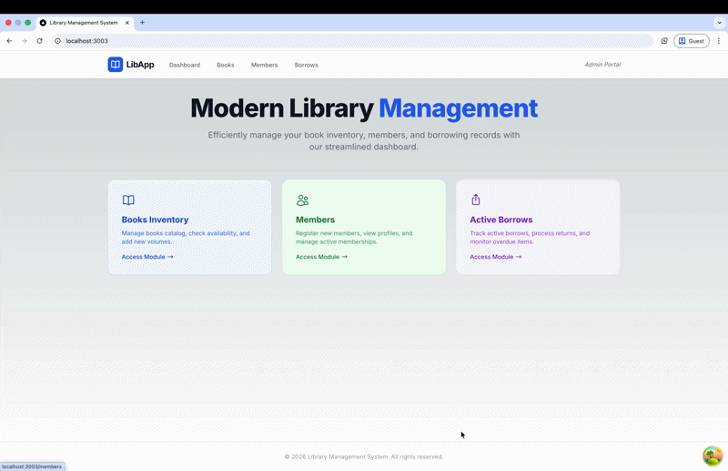
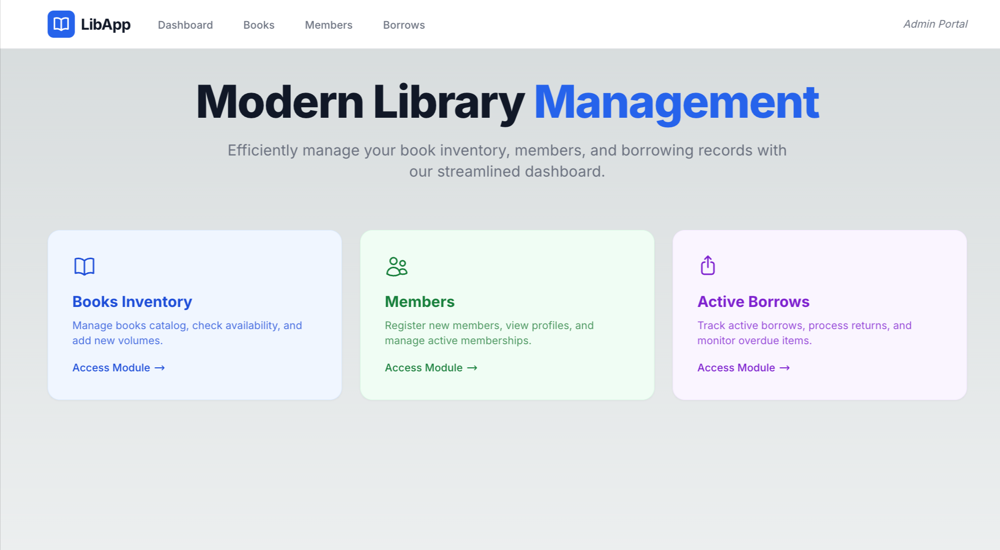
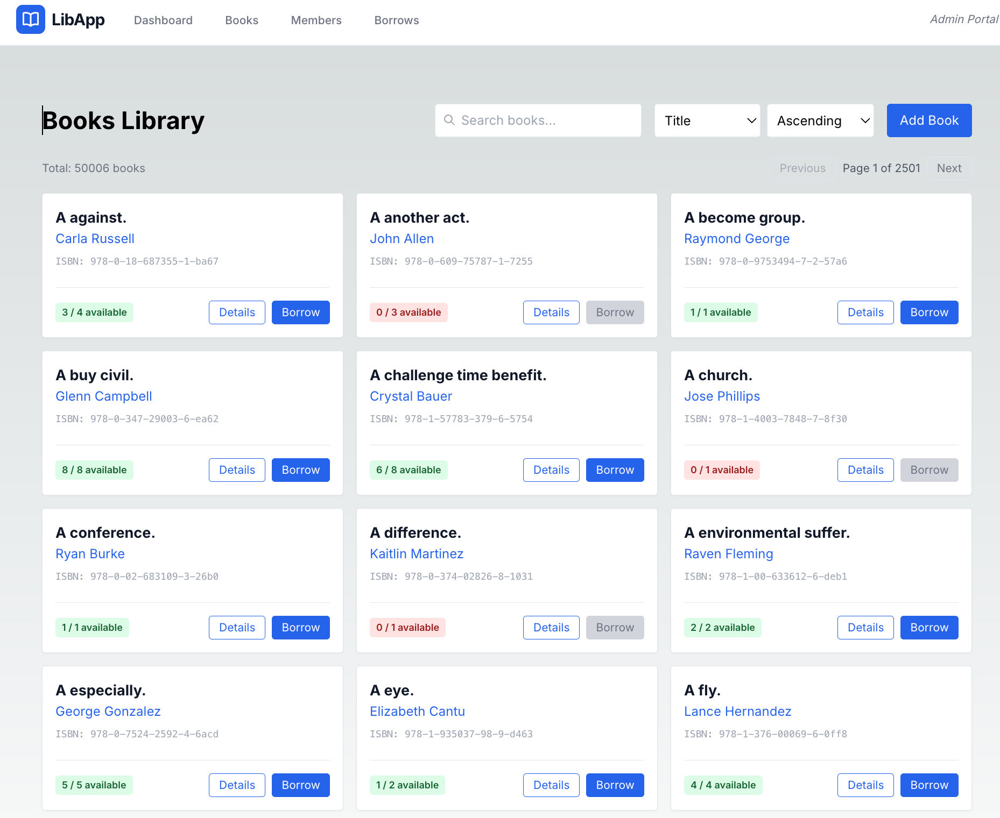
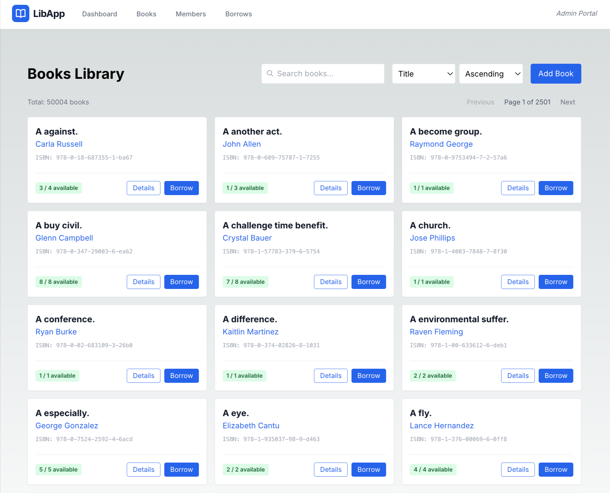
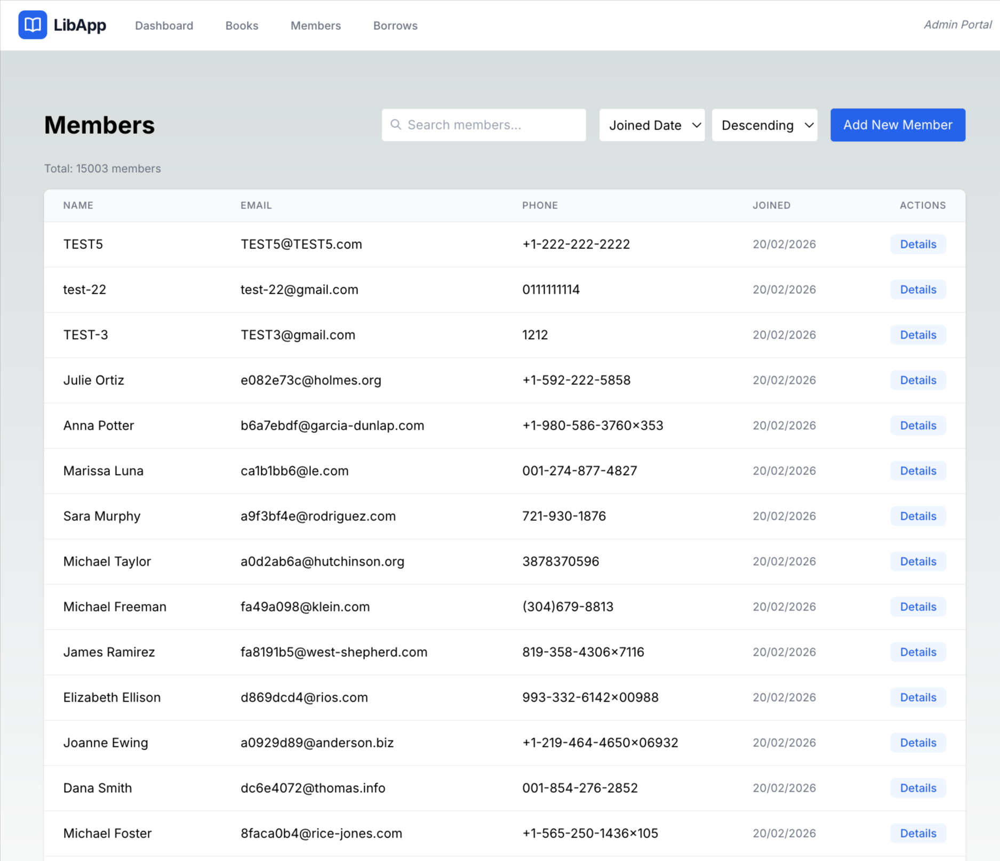
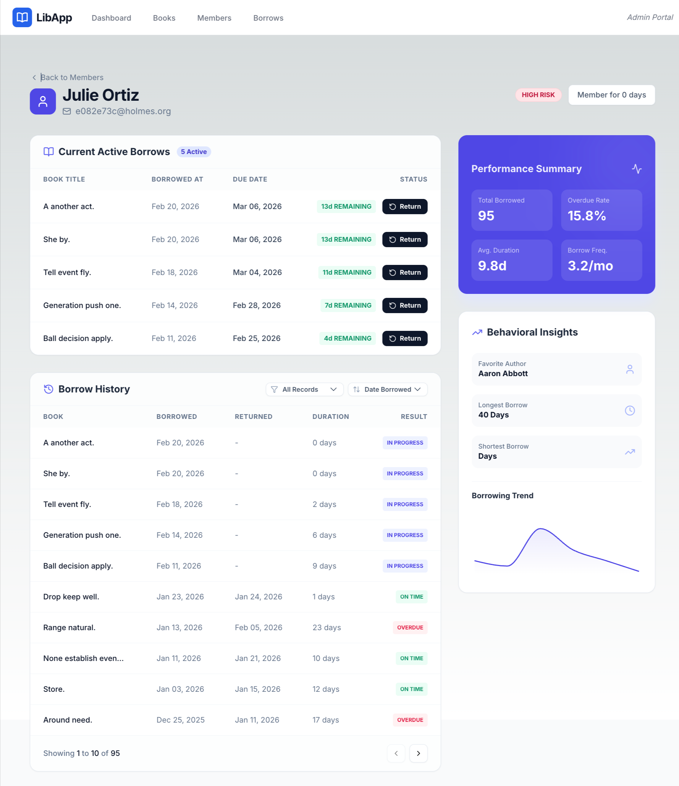
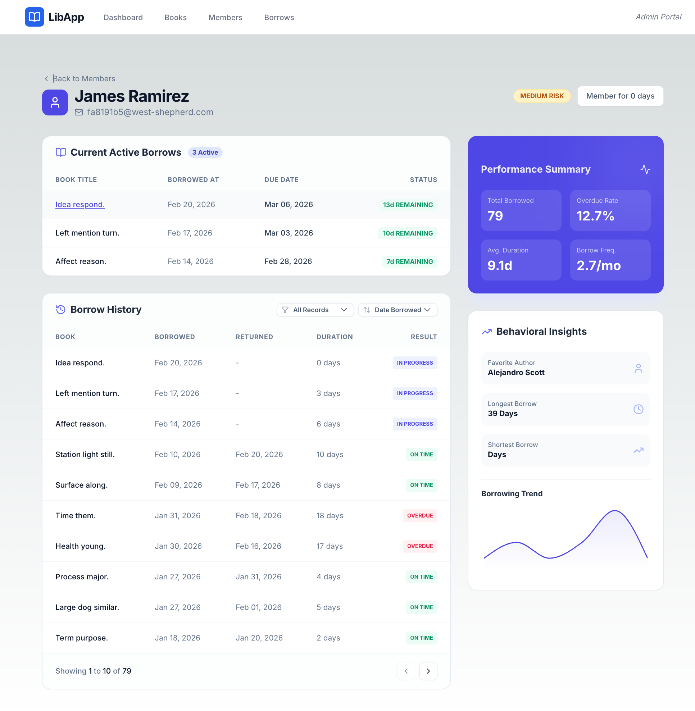

# Neighborhood Library Service

## Overview

This project implements a Library Management Service built to demonstrate clean architecture, data integrity, and scalable design principles.

While the functional scope resembles a typical take-home assignment (books, members, borrowing, returning), the implementation intentionally focuses on:

* Correctness under concurrency
* Clear separation of concerns
* Scalable API modeling
* Realistic data simulation
* Efficient aggregation queries
* Predictable performance at mid-scale

The system supports:

* 50,000 books
* 15,000 members
* ~500,000–1,000,000 borrow records
* 24 months of simulated activity
* Analytics and entity-level insights

This repository is structured to reflect how such a system might evolve in a real-world environment.

# Library Management System

## 🎬 Demo



<p align="center">
  
  
</p>

<p align="center">
  
  
</p>

<p align="center">
  
  
</p>

<p align="center">
  
  
</p>

---

## Tech Stack

### Backend
- **Framework**: [FastAPI](https://fastapi.tiangolo.com/) (Python 3.9+)
- **ORM**: [SQLAlchemy 2.0](https://www.sqlalchemy.org/)
- **Migrations**: [Alembic](https://alembic.sqlalchemy.org/)
- **Validation**: [Pydantic v2](https://docs.pydantic.dev/)
- **Testing**: [Pytest](https://docs.pytest.org/)

### Frontend
- **Framework**: [Next.js 13.5 (App Router)](https://nextjs.org/)
- **Language**: [TypeScript](https://www.typescriptlang.org/)
- **Styling**: [Tailwind CSS](https://tailwindcss.com/)
- **State Management**: [TanStack Query (React Query)](https://tanstack.com/query/latest)
- **Charts**: [Recharts](https://recharts.org/)
- **Icons**: [Lucide React](https://lucide.dev/)

### Infrastructure
- **Database**: [PostgreSQL 15+](https://www.postgresql.org/)
- **Containerization**: [Docker & Docker Compose](https://www.docker.com/)
- **Automation**: [GNU Make](https://www.gnu.org/software/make/)

---

## Prerequisites

Before getting started, ensure you have the following installed:

- **Docker & Docker Compose**: (Required for Database)
- **Python 3.9+**: (Required for Backend)
- **Node.js 18+**: (Required for Frontend)
- **GNU Make**: (Recommended for easy setup)

---

## Project Structure

```text
.
├── backend/               # FastAPI Application
│   ├── alembic/           # Database Migrations
│   ├── app/
│   │   ├── api/          # Route Handlers
│   │   ├── core/         # Configuration & Global Constants
│   │   ├── db/           # Session Management
│   │   ├── models/       # SQLAlchemy Domain Models
│   │   ├── repositories/ # Data Access Layer
│   │   ├── schemas/      # Pydantic DTOs
│   │   ├── seeds/        # Data Seeding Logic
│   │   └── services/     # Business Logic Layer
│   ├── tests/            # Pytest Suite
│   └── requirements.txt
├── frontend/              # Next.js Application
│   ├── app/              # App Router Pages & Layouts
│   ├── components/       # Shared UI Components
│   ├── hooks/            # Custom React Hooks
│   ├── lib/              # API Clients & Utilities
│   └── types/            # TypeScript Interfaces
├── Makefile               # Project Automation Root
└── docker-compose.yml     # Infrastructure Orchestration
```

---

## Architecture

The service follows a strict layered architecture:

```
Router → Service → Repository → Database
```

### Router Layer

Responsible only for:

* HTTP validation
* Serialization
* Error mapping

No business logic exists in routers.

### Service Layer

Responsible for:

* Business rules
* Transaction management
* Concurrency control
* Input validation

This is where borrowing logic, inventory protection, and invariant enforcement live.

### Repository Layer

Responsible for:

* Database access
* Query optimization
* Aggregation queries
* Pagination mechanics

Repositories never contain business rules.

### Database

The database enforces:

* Referential integrity
* Check constraints
* Indexing
* Transaction isolation

This structure keeps the system maintainable and testable as it grows.

---

## Data Model

### Core Tables

* `books`
* `members`
* `borrow_records`

### Key Decisions

* UUID primary keys
* Database-level constraints
* Indexed time-series fields
* Partial indexes for active borrows
* Deterministic ordering for pagination

### Important Indexes

Borrow records are indexed on:

* `book_id`
* `member_id`
* `borrowed_at`
* `returned_at`
* `due_date`

These indexes ensure that:

* Borrow history queries remain efficient
* Analytics queries scale predictably
* Overdue detection remains fast
* Popularity ranking does not degrade

---

## Borrowing Model & Concurrency

Borrowing operations are fully transactional and concurrency-safe.

The system:

* Uses row-level locking (`SELECT FOR UPDATE`)
* Updates inventory atomically
* Prevents negative inventory
* Enforces borrow limits
* Prevents duplicate active borrows

The goal is simple: correctness first.

Even under concurrent requests, inventory integrity is guaranteed.

---

## API Design

All list endpoints follow a standardized pagination model:

```
GET /resource?limit=20&offset=0&sort=-created_at&q=search
```

Response structure:

```json
{
  "data": [...],
  "meta": {
    "total": 100,
    "limit": 20,
    "offset": 0,
    "has_more": true
  }
}
```

### Why Offset Pagination?

Offset-based pagination was chosen for clarity and simplicity at this scale.
The design intentionally caps page size to prevent unbounded scans.

Cursor-based pagination would be preferable at significantly higher data volumes and is documented as a future enhancement.

---

## Resource Modeling

Heavy nested data is intentionally separated into dedicated endpoints:

```
GET /members/{id}
GET /members/{id}/borrows
GET /members/{id}/analytics

GET /books/{id}
GET /books/{id}/borrows
GET /books/{id}/analytics
```

This avoids:

* Large payload coupling
* Unbounded history responses
* Poor cacheability
* Tight coupling between detail and aggregation data

---

## Frontend Architecture

The frontend is built for performance and maintainability using modern React patterns:

### Server State Management
We use **React Query** for all data fetching. This provides:
- Automatic caching and revalidation
- Loading and error states out of the box
- Simplified pagination and search synchronization

### Component Design
- **Atomic Components**: Reusable UI elements (Buttons, Cards, Modals).
- **Page-Level Layouts**: High-level structural components.
- **Client-Side Navigation**: leverages Next.js `Link` for instant page transitions.

### Typescript Integration
The system uses strict TypeScript interfaces shared across all components to ensure API payload consistency.

---

## Analytics

The system includes analytics endpoints that provide:

* Borrow trends (24 months)
* Top books
* Top members
* Overdue bucket distribution
* Inventory utilization ratio
* Member risk segmentation
* Book popularity ranking

All analytics are computed in the database using aggregation queries.
No large dataset is processed in application memory.

This ensures predictable performance even at ~1M borrow records.

---

## Realistic Data Seeding

A large-scale behavioral seeder is included.

It generates:

* 50,000 books
* 15, 000 members
* 30 months of borrow history
* 500k–1M borrow records

### Behavioral Modeling

Books are divided into popularity tiers:

* Highly popular
* Moderate
* Low activity
* Never borrowed

Members are segmented into:

* Heavy readers
* Regular readers
* Casual readers
* Inactive members

The seeder also simulates:

* Seasonal borrow variation
* Overdue probability
* Active borrow distribution
* Inventory consistency validation
* Deterministic random seed


---

## High-Scale Performance Validation

To verify the system's stability and performance at its maximum design capacity, follow these steps:

1.  **Purge Environment**: Ensure a clean slate by wiping all existing data and containers:
    ```bash
    make docker-down
    ```

2.  **Execute High-Scale Setup**: This performs a "Cold Start" with 50k books, 15k members, and 1M+ records:
    ```bash
    make setup-high
    ```

3.  **Start Services**:
    ```bash
    make start
    ```

4.  **Audit Performance**:
    -   Navigate to the **Dashboard** and verify that 30 months of activity are aggregated within ~2 seconds.
    -   Use the **Global Search** in the Books library to verify sub-500ms response times across 50,000 records.
    -   Check **Book Details** for popular titles to ensure complex history analytics are calculated accurately and instantly.

---

## Performance Considerations

At this scale:

* Bulk inserts are used during seeding
* Session flushing is controlled
* Aggregation queries rely on indexed fields
* Borrow history is always paginated
* N+1 queries are avoided
* Deterministic ordering is enforced

The system is designed to scale predictably without premature optimization.

---

## Quick Start (Local Development)

The easiest way to get started is using the provided `Makefile`.

1.  **Setup Environment**:
    Install dependencies, start the database, and seed initial data:
    ```bash
    make setup
    ```

2.  **Start Services**:
    Launch both backend and frontend servers:
    ```bash
    make start
    ```

3.  **Access**:
    -   Frontend: [http://localhost:3003](http://localhost:3003)
    -   Backend API Docs: [http://localhost:8000/docs](http://localhost:8000/docs)

---

## Environment Configuration

The system is designed to work with minimal configuration out of the box. Configuration is managed via `.env` files.

| Variable | Default | Description |
| :--- | :--- | :--- |
| `POSTGRES_USER` | `user` | Database username |
| `POSTGRES_PASSWORD` | `password` | Database password |
| `POSTGRES_DB` | `library` | Database name |
| `POSTGRES_SERVER` | `localhost` | Database host (use `db` inside Docker) |
| `POSTGRES_PORT` | `5432` | Database port |
| `ENVIRONMENT` | `development` | Runtime environment |

---

## Developer Workflow

Use these commands frequently during development to maintain code quality:

| Command | Description |
| :--- | :--- |
| `make test` | Runs the full backend test suite (Pytest + Coverage) |
| `make lint` | Runs full-stack linting (Ruff, Mypy, ESLint) |
| `make format`| Auto-formats backend code using Ruff |
| `make db-fresh` | Resets, Migrates, and Re-seeds the DB (Clean slate) |
| `make db-migration m='msg'` | Generates a new database migration file |
| `make db-shell`| Opens an interactive `psql` shell in the database container |
| `make docker-up`| Starts all services in detached Docker containers |
| `make docker-down`| Stops all services and wipes data volumes |
| `make clean` | Wipes caches and temporary development artifacts |

---

---

## Testing Strategy

Testing focuses on correctness and invariants:

* Unit tests for business rules
* Concurrency tests for borrow operations
* Pagination validation
* Analytics correctness verification
* Seeder distribution constraint checks


---

## Scalability & Reliability Roadmap

If this system were to scale further, the following enhancements would be introduced:

### Database

* Partition `borrow_records` by month
* Introduce read replicas for analytics
* Materialized views for heavy aggregations

### API

* Cursor-based pagination
* Short-lived caching layer (Redis)

### Reliability

* Idempotency keys for write operations
* Background job processing
* Observability (metrics + tracing)


---

## Design Philosophy

This project intentionally avoids unnecessary abstraction and premature optimization.

It prioritizes:

* Correctness under concurrency
* Clean separation of responsibilities
* Predictable performance
* Realistic system behavior
* Clear scaling path


---

## Troubleshooting

### Common Port Conflicts
The system defaults to ports `8000` (Backend) and `3003` (Frontend).

- **EADDRINUSE (8000)**: Backend is already running or another process is using it. Kill it with:
  ```bash
  lsof -ti:8000 | xargs kill -9
  ```
- **EADDRINUSE (3003)**: Frontend is already running. Kill it with:
  ```bash
  lsof -ti:3003 | xargs kill -9
  ```

### Database Connectivity
If the backend cannot connect to PostgreSQL:
1. Ensure the container is running: `make docker-ps`
2. Check logs: `docker-compose logs db`
3. Try a fresh start: `make db-fresh`
